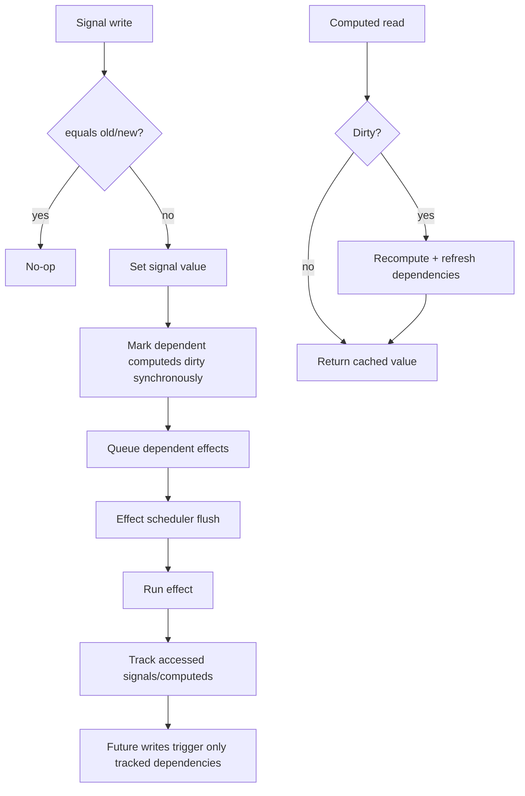

# SuperTinySignal

A no-nonsense, type-safe, tiny reactive library for production apps.

[](https://www.npmjs.com/package/super-tiny-signal)
[](LICENSE)

---

## Installation

```bash
npm install super-tiny-signal
```

---

## Quick start

```ts
import { signal, computed, effect } from "super-tiny-signal";

const count = signal(1);
const doubled = computed(() => count.value * 2);

const dispose = effect(() => {
  console.log("count:", count.value, "doubled:", doubled.value);
});

count.value = 2; // logs updated values

dispose(); // stop reacting
```

## Core primitives

### `signal(initialValue, options?)`

Create a reactive value.

```ts
import { signal } from "super-tiny-signal";

const name = signal("Ada");
name.value = "Grace";

const custom = signal(
  { x: 1, y: 2 },
  {
    equals: (a, b) => a.x === b.x && a.y === b.y,
  }
);
```

### `computed(fn, options?)`

Create derived reactive state. Lazy by default, with optional eager mode.

```ts
import { signal, computed } from "super-tiny-signal";

const price = signal(100);
const taxRate = signal(0.2);

const total = computed(() => price.value * (1 + taxRate.value));
console.log(total.value); // 120
```

### `effect(fn)`

Run a side effect that auto-tracks dependencies. Returns a disposer.

```ts
import { signal, effect } from "super-tiny-signal";

const online = signal(false);

const stop = effect(() => {
  document.body.dataset.online = String(online.value);
});

online.value = true;
stop();
```

### `batch(fn)`

Batch multiple writes and flush effects once.

```ts
import { signal, batch, effect } from "super-tiny-signal";

const a = signal(1);
const b = signal(2);

effect(() => {
  console.log(a.value + b.value);
});

batch(() => {
  a.value = 10;
  b.value = 20;
});
```

## Hook-like helpers

Plain-function utilities, not tied to React.

### `useState(initialValue)`

```ts
import { useState } from "super-tiny-signal";

const [count, setCount] = useState(0);
setCount(1);
setCount((prev) => prev + 1);
```

### `useMemo(fn, options?)`

Returns a computed signal.

```ts
import { useMemo, signal } from "super-tiny-signal";

const items = signal([1, 2, 3]);
const total = useMemo(() => items.value.reduce((s, n) => s + n, 0));

console.log(total.value);
```

### `useEffect(fn)`

Supports cleanup on rerun and disposal.

```ts
import { useEffect, signal } from "super-tiny-signal";

const query = signal("initial");

const dispose = useEffect(() => {
  const controller = new AbortController();

  fetch(`/search?q=${query.value}`, { signal: controller.signal });

  return () => controller.abort();
});

dispose();
```

## Store API

`createStore` builds a signal-backed store with immutable methods and subscription support.

```ts
import { createStore } from "super-tiny-signal";

const store = createStore((set, get) => ({
  count: 0,
  label: "counter",
  inc: () => set({ count: get().count + 1 }),
  reset: () => set({ count: 0 }),
}));

store.inc();
console.log(store.count.value); // 1

const unsubscribe = store.subscribe((state) => {
  console.log("state changed:", state);
});

store.setState({ label: "main" });
unsubscribe();
```

### Store notes

- Non-function state fields are wrapped as signals (`store.field.value`).
- Function fields become immutable store methods.
- Reserved state keys are blocked: `getState`, `setState`, `subscribe`.

## Persistence

Use `persist` middleware with `createStore`.

```ts
import {
  createStore,
  persist,
  createJSONStorage,
} from "super-tiny-signal";

const storage = createJSONStorage(() => localStorage);

const store = createStore(
  persist(
    () => ({
      theme: "light",
      sidebarOpen: true,
    }),
    {
      name: "app-settings",
      storage,
      version: 1,
      onHydrated: (state) => {
        console.log("hydrated", state);
      },
      onError: (error, operation) => {
        console.error("persist", operation, error);
      },
    }
  )
);
```

IndexedDB adapter:

```ts
import { createIndexedDBStorage } from "super-tiny-signal";

const indexed = createIndexedDBStorage({
  dbName: "app-db",
  storeName: "keyval",
});
```

## Documentation

- [Architecture overview](docs/README.md)
- [Reactivity internals](docs/reactivity.md)
- [Store and persistence](docs/store-and-persistence.md)

---

## API surface

```ts
import {
  signal,
  computed,
  effect,
  batch,
  createStore,
  persist,
  createJSONStorage,
  createIndexedDBStorage,
  useState,
  useMemo,
  useEffect,
  deepEqual,
} from "super-tiny-signal";
```

## Advanced

<details>
<summary><strong>Core reactive flow (Mermaid diagram)</strong></summary>



</details>

<details>
<summary><strong>Consistency and safety guarantees</strong></summary>

- Computed invalidation is synchronous, so immediate reads after writes see fresh values.
- Effects are scheduled and flushed with loop protection to avoid runaway recursion.
- Dependency tracking is dynamic: unused branches are unsubscribed on recompute.
- Equality defaults to `Object.is` and can be overridden per signal/computed.
- Store subscriber errors can be handled via `onSubscriberError` config.

</details>

<details>
<summary><strong>Behavior notes and pitfalls</strong></summary>

- `useState` treats function arguments in setter form as updater functions.
- `persist` stores `{ state, version }` metadata under the configured key.
- Persistence adapters are async by contract, even when underlying storage is sync.
- For unsupported JSON values (circular references, etc.), handle errors via `onError`.

</details>

## Production checklist

- Use strict TypeScript mode in your app.
- Add app-level tests around your critical reactive flows.
- Prefer deterministic tests (`flush`-driven) over timer windows.
- Use custom `equals` only when you fully understand its invalidation impact.

---

## Development

```bash
npm run build
bun test
```

---

## License

MIT
