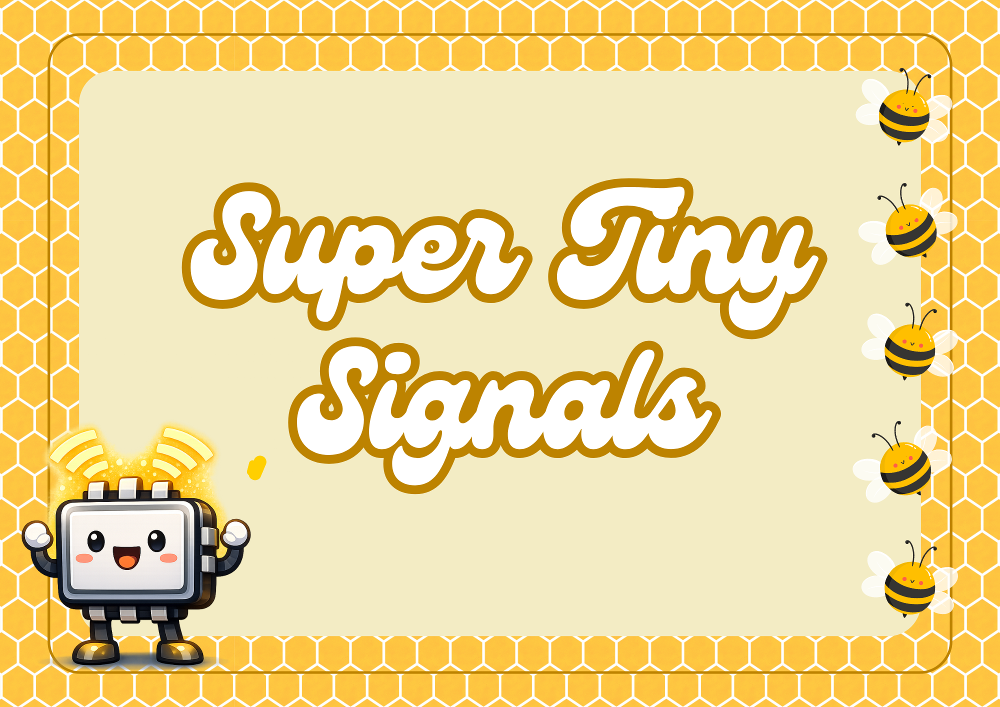

Tiny, framework-agnostic reactivity for TypeScript apps.

If you want signal-style state without pulling in a full UI framework, this is for you.

[](https://www.npmjs.com/package/super-tiny-signal) [](LICENSE)

---

## Installation

```bash
npm install super-tiny-signal
```

---

## Quick start

```ts
import { signal, derived, effect } from "super-tiny-signal";

const [count, setCount] = signal(1);
const doubled = derived(() => count() * 2);

const stop = effect(() => {
  console.log(`count=${count()} doubled=${doubled()}`);
});

setCount(2);
stop();
```

---

## Why SuperTinySignal

- Predictable updates: computed values invalidate immediately on writes.
- Small API: learn the core in minutes and use only what you need.
- TypeScript-first: strong inference for signals, stores, and helpers.
- Framework-agnostic: works with plain HTML, custom renderers, or any framework.
- Practical extras: store helpers, persistence middleware, and storage adapters.

---

## Core API

### Reactivity primitives

```ts
import { signal, derived, effect, batch, bindText, bindAttr, on } from "super-tiny-signal";

const [a, setA] = signal(1);
const [b, setB] = signal(2);
const sum = derived(() => a() + b());

const dispose = effect(() => {
  console.log("sum", sum());
});

batch(() => {
  setA(10);
  setB(20);
});

const output = document.createElement("p");
bindText(output, () => `sum=${sum()}`);
bindAttr(output, "data-ready", () => (sum() > 0 ? "yes" : null));
on(document.body, "click", () => console.log("clicked body"));

dispose();
```

### Hook-style helpers (Framework Agnostic)

```ts
import { useState, useMemo, useEffect } from "super-tiny-signal";

const [count, setCount] = useState(0);
const doubled = useMemo(() => count() * 2);

const stop = useEffect(() => {
  console.log("doubled", doubled());
});

setCount((prev) => prev + 1);
stop();
```

### Store + persistence

```ts
import { createStore, persist, createJSONStorage } from "super-tiny-signal";

const storage = createJSONStorage(() => localStorage);

const store = createStore(
  persist(
    () => ({
      count: 0,
      theme: "light",
    }),
    { name: "counter", storage, version: 1 },
  ),
);

store.setState({ theme: "dark" });
console.log(store.getState().theme);
```

## Before vs after

```ts
// Before
const count = signal(0);
count.value = count.value + 1;
effect(() => console.log(count.value));

// After
const [count, setCount] = signal(0);
setCount((prev) => prev + 1);
effect(() => console.log(count()));
```

- Less boilerplate: no repetitive `.value` in most reactive code.
- Better vanilla DOM DX: direct `bindText`/`bindAttr`/`on` helpers, no VDOM.
- Safer lifecycle: scope-aware cleanup when bound DOM nodes are removed.

---

## Documentation

- [Architecture overview](docs/README.md)
- [Reactivity internals](docs/reactivity.md)
- [Store and persistence](docs/store-and-persistence.md)
- [Callable-signal migration guide](docs/migration/callable-signals.md)

---

## Full exports

```ts
import {
  signal,
  derived,
  computed,
  effect,
  batch,
  createStore,
  persist,
  createJSONStorage,
  createIndexedDBStorage,
  useState,
  useMemo,
  useEffect,
  bindText,
  bindAttr,
  on,
  deepEqual,
} from "super-tiny-signal";
```

---

## Development

```bash
npm run build
bun test
```

---

## License

[MIT](LICENSE)
