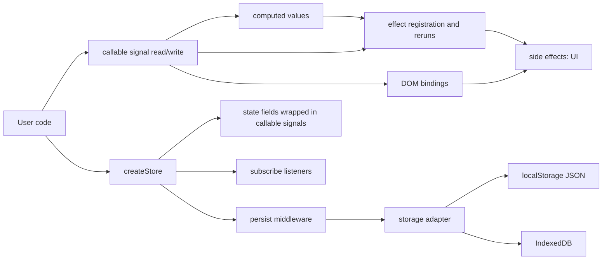

# docs

This folder explains how Super Tiny Signal works under the hood.

If you are new to the project, read in this order:

1. `reactivity.md`
2. `store-and-persistence.md`

## architecture at a glance

## files

- `reactivity.md`: signals, computed values, effect tracking, batching, and scheduling
- `reactivity.md`: callable signals, computed values, effect tracking, batching, and scheduling
- `store-and-persistence.md`: `createStore`, subscriptions, `persist`, and storage adapters

## quick mental model

- A `signal` stores a value and is usually read with `signal()` and written with `signal(next)`.
- An `effect` runs immediately, tracks dependencies while running, then reruns when those dependencies change.
- A `computed` is a read-only signal that derives from other signals and updates lazily (or eagerly when configured).
- DOM helpers (`bindText`, `bindAttr`, `on`) connect reactive values directly to vanilla elements.
- A store is plain state plus actions, where non-function state fields are internally signal-backed.
- Persistence wraps store updates so state is loaded on startup and saved after writes.
