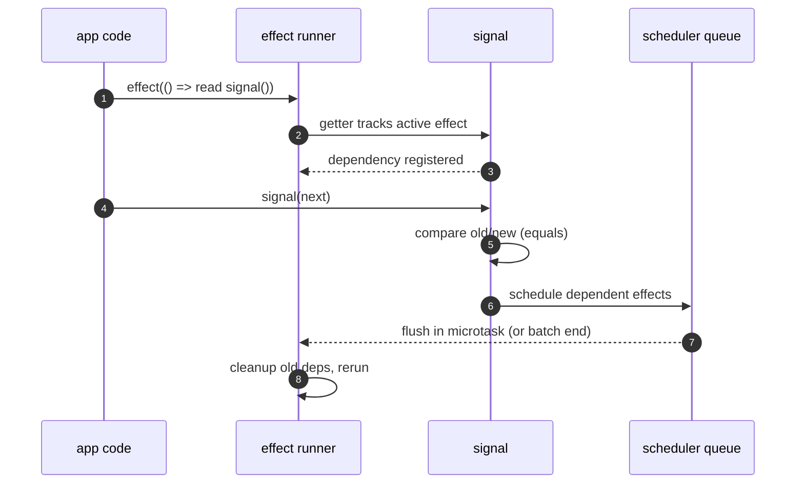
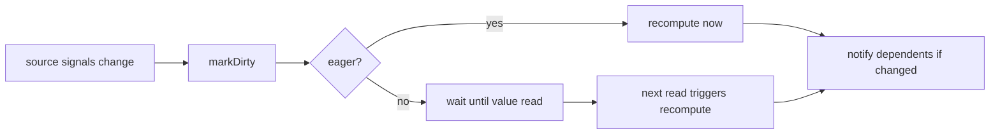

# reactivity internals

This document explains how signals, computed values, and effects connect.

## dependency tracking flow

## signals

`signal<T>()` returns a callable value container with dependency awareness.

- Read (`count()`) from inside an active effect/computed and it records that dependency.
- Write (`count(next)` or `count(prev => next)`) and it schedules all dependent effects.
- Comparisons use `Object.is` by default, or a custom `equals` function.
- `.peek()` reads without tracking.
- `.value` remains available in beta as a migration-friendly alias.

In short: reads create links, writes trigger reruns.

## effects and scheduler

Effects use a stack (`activeEffects`) and a scheduler queue.

- `effect(fn)` runs immediately once, then reruns on dependency changes.
- During each run, dependencies are collected from every signal read.
- Before rerun, old dependencies are detached to avoid stale links.
- `scheduleEffect` queues work in a microtask so many updates can collapse into one flush.
- `batch(fn)` delays flushing until the outermost batch finishes.

That batching behavior is what keeps rapid writes from spamming effect executions.

## computed values

`computed<T>()` returns a callable, read-only derived signal.

- It tracks source dependencies by running with an internal marker effect (`markDirty`).
- When a source changes, computed becomes dirty.
- Reading `derived()` recomputes if dirty, then returns cached value.
- Optional `eager: true` recomputes immediately when dependencies change.
- Writes are blocked (`Cannot set value of a computed signal`).

## practical tips

- Use `batch` around grouped writes.
- Prefer `computed` for derivations instead of duplicating state.
- Use `peek()` when you must read without creating a dependency.
