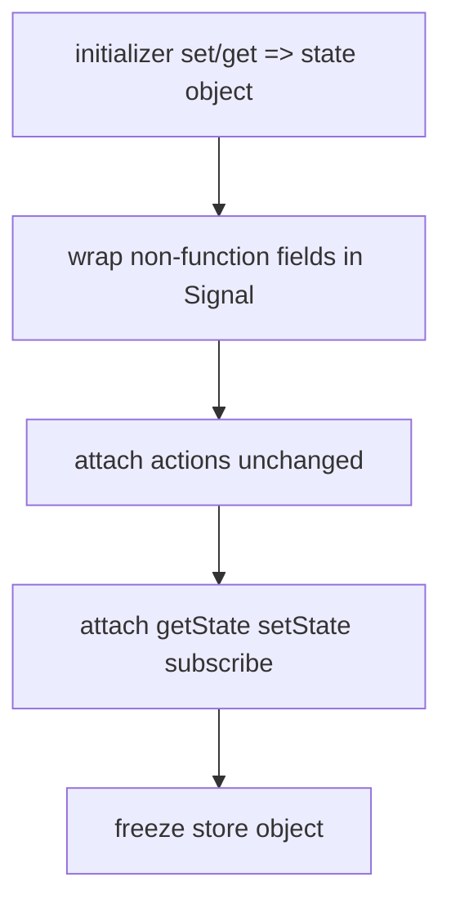
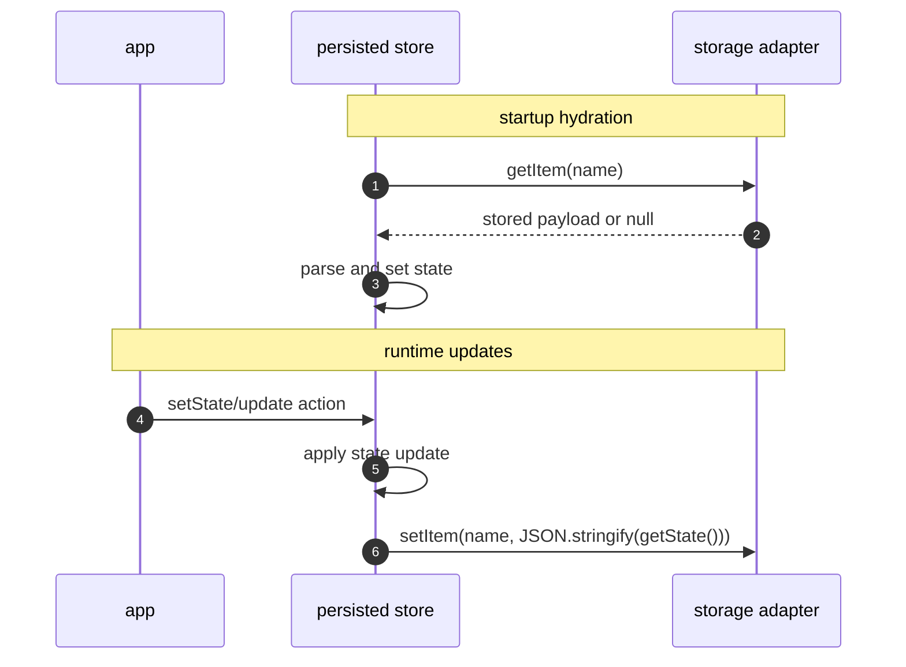

# store and persistence

This doc covers how `createStore` manages state and how `persist` saves it.

## createStore lifecycle

At creation time:

1. Your initializer returns a state object with fields and actions.
2. Non-function fields are wrapped in `Signal` instances.
3. Function fields are kept as callable actions.
4. The returned store is frozen and extended with helpers:
   - `getState()`
   - `setState(...)`
   - `subscribe(listener)`



## updates and subscribers

`setState` accepts either:

- a partial object (`{ count: 1 }`)
- an updater function (`prev => ({ count: prev.count + 1 })`)

For each changed key:

- Signal-backed keys compare old/new values.
- Equality check uses `deepEqual` when `deepEquality: true`; otherwise `Object.is`.
- If changed, the signal value is updated.
- After updates, subscribers are notified through the scheduler queue.

Subscriber notifications are scheduled so multiple rapid updates can coalesce.

## persistence flow

`persist(initializer, { name, storage })` wraps a store initializer.

On startup:

- It asynchronously calls `storage.getItem(name)`.
- If data is found, it parses and hydrates state with `set(...)`.

On each persisted set:

- It performs the original `set(...)`.
- Then saves `JSON.stringify(get())` using `storage.setItem(name, ...)`.



## adapter options

- `createJSONStorage(() => localStorage)` for browser local storage.
- `createIndexedDBStorage(dbName, storeName)` for IndexedDB.

Both implement a common async adapter interface:

```ts
interface StorageAdapter {
  getItem(key: string): Promise<any | null>;
  setItem(key: string, value: any): Promise<void>;
}
```

## gotchas

- Hydration is async. If your UI depends on persisted state, handle the initial pre-hydration render.
- Unknown keys passed to `setState` are ignored with a warning.
- If a subscriber throws, `onSubscriberError` can centralize handling.
